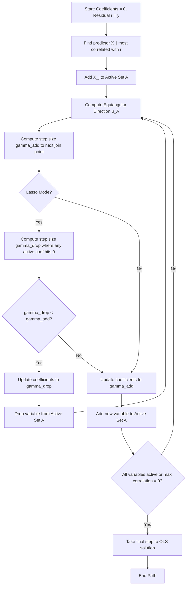

# 📐 Least Angle Regression (LARS) in R

[](https://www.r-project.org/)
[](file:///Users/ramakrushnamishra/Documents/antigravity/noble-franklin/tests/test_lars.R)
[](file:///Users/ramakrushnamishra/Documents/antigravity/noble-franklin/shiny_app/app.R)
[](https://opensource.org/licenses/MIT)

An elegant, mathematically rigorous implementation of the **Least Angle Regression (LARS)** and **LARS-Lasso** algorithms in R from scratch, complete with automated validation tests, example vignettes, and an interactive step-by-step Shiny dashboard visualization.

---

## 🚀 Features

* **Pure R Implementation**: Standard LARS (Least Angle Regression) and LARS-Lasso path algorithms written from scratch using matrix formulations.
* **Identical to CRAN**: Mathematically validated to output coefficients, path histories, action sequences, and lambdas identical to CRAN's official `lars` package.
* **Interactive Shiny Dashboard**: A beautiful, custom dark-themed Shiny application allowing you to step through the algorithm frame-by-frame and visualize correlation boundaries, active coefficients, and paths.
* **Comprehensive Documentation**: Complete math explanations (LaTeX) and an R Markdown vignette.

---

## 📁 Directory Structure

```
├── README.md                 # Project introduction, math, and usage guide
├── R/
│   └── lars_impl.R           # Core implementation (lars_fit, predict, plot)
├── tests/
│   └── test_lars.R           # Verification suite comparing against CRAN's lars
├── examples/
│   ├── diabetes_demo.R       # Example script fitting LAR & Lasso on Diabetes data
│   └── LARS_vignette.Rmd     # Detailed vignette compiled with LaTeX equations
└── shiny_app/
    ├── app.R                 # Beautiful interactive Shiny visualizer app
    └── www/
        └── styles.css        # Premium custom stylesheet for the Shiny dashboard
```

---

## 🧠 Theoretical Background & Math

LARS builds a sparse linear regression model sequentially. Rather than fitting a variable completely (like Forward Selection) or taking tiny steps (like Forward Stagewise), LARS moves coefficients along an **equiangular direction** between all currently active features until another variable reaches the same absolute correlation with the residual.

### Algorithm Flowchart



### Mathematical Equations

#### 1. Standardization
Predictors $X$ are standardized to have zero mean and unit $L_2$ norm, and response $y$ is centered:

```math
\sum_{i=1}^n X_{ij} = 0, \quad \sum_{i=1}^n X_{ij}^2 = 1, \quad \sum_{i=1}^n y_i = 0
```

#### 2. Equiangular Vector ($u_{\mathcal{A}}$)
For an active set $\mathcal{A}$ and signs $s_{\mathcal{A}} = \text{sign}(X_{\mathcal{A}}^T r)$, let $X_{\mathcal{A}} = [s_j X_j]_{j \in \mathcal{A}}$ and $G_{\mathcal{A}} = X_{\mathcal{A}}^T X_{\mathcal{A}}$. The equiangular direction vector $u_{\mathcal{A}}$ is:
```math
u_{\mathcal{A}} = X_{\mathcal{A}} w_{\mathcal{A}} \quad \text{where} \quad w_{\mathcal{A}} = A_{\mathcal{A}} \, G_{\mathcal{A}}^{-1} \mathbf{1}_{\mathcal{A}}, \quad A_{\mathcal{A}} = \bigl(\mathbf{1}_{\mathcal{A}}^T G_{\mathcal{A}}^{-1} \mathbf{1}_{\mathcal{A}}\bigr)^{-1/2}
```

This guarantees that the projection of the direction onto all active variables is identical: $X_{\mathcal{A}}^T u_{\mathcal{A}} = A_{\mathcal{A}} \mathbf{1}_{\mathcal{A}}$.

#### 3. Step Length ($\hat{\gamma}$)
The step size $\hat{\gamma}$ to add the next variable $j \in \mathcal{A}^c$ is the smallest positive value where its correlation with the residual catches up to the active set correlation $\hat{C} = \max_j |c_j|$:
```math
\hat{\gamma} = \min_{j \in \mathcal{A}^c}^{+} \left\{ \frac{\hat{C} - c_j}{A_{\mathcal{A}} - a_j},\ \frac{\hat{C} + c_j}{A_{\mathcal{A}} + a_j} \right\}, \quad \text{where} \quad a = X^T u_{\mathcal{A}}
```

#### 4. Lasso Coefficient Drop ($\tilde{\gamma}$)
If `type = "lasso"`, we monitor the active coefficients $\beta_{\mathcal{A}}$ moving along the path $\beta_{\mathcal{A}}(\gamma) = \beta_{\mathcal{A}} + \gamma \tilde{w}_{\mathcal{A}}$ where $\tilde{w}_{\mathcal{A}} = s_{\mathcal{A}} \circ w_{\mathcal{A}}$. The step length $\tilde{\gamma}$ where a coefficient hits 0 is:
```math
\tilde{\gamma} = \min_{j \in \mathcal{A}}^{+} \left\{ -\frac{\beta_j}{\tilde{w}_j} \right\}
```
If $\tilde{\gamma} < \hat{\gamma}$, we truncate the step at $\tilde{\gamma}$, remove that variable, and recompute the direction.

---

## 🏁 Quick Start & Usage

Ensure you have R installed. You can clone the repository and run the scripts directly.

### Running the Demo Script
To fit LARS and LARS-Lasso on the classic diabetes dataset and output summaries and plots:
```bash
Rscript examples/diabetes_demo.R
```
This generates the coefficient path plots in the `outputs/` folder:
- `outputs/lars_path.png`
- `outputs/lasso_path.png`

### Core R Code Usage

```R
# Source the custom implementation
source("R/lars_impl.R")

# Load your data
X <- as.matrix(your_predictors)
y <- as.numeric(your_response)

# Fit LARS-Lasso Path
fit <- lars_fit(X, y, type = "lasso")

# Print summary
print(fit$actions)

# Plot coefficient path
plot(fit)

# Predict at step 5.5 (interpolated)
pred <- predict(fit, newx = X, s = 5.5, type = "fit")
head(pred$fit)
```

---

## 🖥️ Interactive Shiny App Visualizer

We provide a custom dark-themed dashboard to visually explore the LARS path. It displays the solution path, Mallows' Cp metric, and the **residual correlations** highlighting how active variables are tied at the maximum correlation boundary.

> [!TIP]
> Use the **Play/Pause** playback controls in the Shiny dashboard to watch variables join and drop from the active set automatically!

### How to Run the Shiny App
Start the Shiny app from the project root directory:
```bash
Rscript -e "shiny::runApp('shiny_app')"
```
This launches a browser window showing the interactive visualization.

---

## 📊 Simulation Study

We recreated the simulation study described in **Section 7 of the LARS paper (Efron et al., 2004)**. It constructs a quadratic model with $m = 64$ predictors (including squares and pairwise interactions) from the 10 main effects of the diabetes dataset, fits a true mean vector from a 10-step LARS fit, and runs multiple replications with Gaussian noise to track the average proportion of variance ($R^2$) explained at each step.

### Running the Simulation
```bash
Rscript examples/lars_simulation.R
```

---

## ✅ Verification Results

Our custom implementation is thoroughly verified against CRAN's official `lars` package. You can run the test suite to confirm:
```bash
Rscript tests/test_lars.R
```

<details>
<summary><b>Click to expand verification log</b></summary>

```
==========================================
Starting LARS Implementation Verification
==========================================

Running Test 1: Lasso Path comparison...
  Max difference in lambdas: 0.00000000
  Max difference in beta coefficients: 0.00000001
  CRAN actions:  3, 9, 4, 7, 2, 10, 5, 8, 6, 1, -7, 7 
  Custom actions: 3, 9, 4, 7, 2, 10, 5, 8, 6, 1, -7, 7 
  Actions match exactly: TRUE 

Running Test 2: Standard LARS path comparison...
  Max difference in lambdas: 0.00000000
  Max difference in beta coefficients: 0.00000006
  CRAN actions:  3, 9, 4, 7, 2, 10, 5, 8, 6, 1 
  Custom actions: 3, 9, 4, 7, 2, 10, 5, 8, 6, 1 
  Actions match exactly: TRUE 

Running Test 3: Prediction interpolation test...
  Max difference in predictions at step 4.5: 0.00000000

==========================================
SUCCESS: All tests passed successfully!
==========================================
```
</details>
